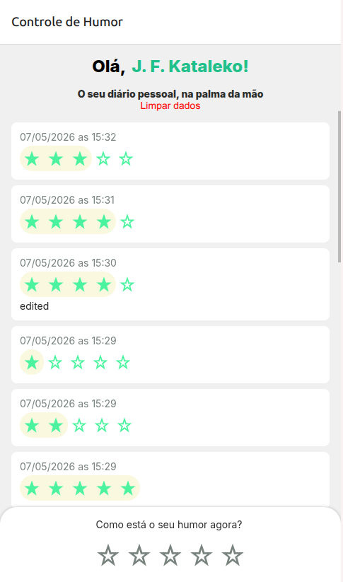
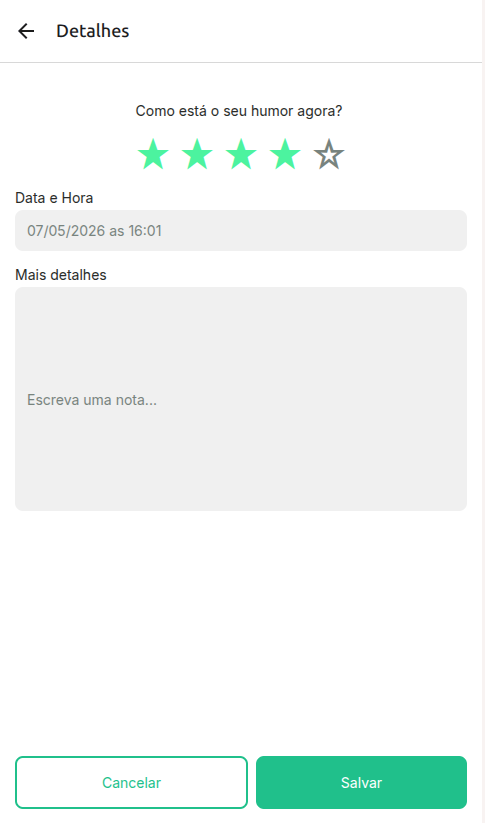

# HumorTrackApp

<p align="center">
  
  
</p>


## 🎥 Vídeo de demonstração

### Link do vídeo
[Assistir no YouTube](https://youtube.com/watch?v=SEU_VIDEO_ID)


## 📱 App de controle de humor pessoal com React Native e Expo

O **HumorTrackApp** é um aplicativo mobile desenvolvido com React Native e Expo para registrar, acompanhar e visualizar o humor diário do usuário.

O aplicativo permite:
- cadastro do nome do usuário
- registro de humor com avaliação em estrelas
- descrição detalhada do estado emocional
- edição de registros
- exclusão de registros
- armazenamento local persistente

---

## ✨ Funcionalidades

- ✅ Cadastro do nome do usuário
- ✅ Registro de humor diário
- ✅ Sistema de avaliação com estrelas
- ✅ Edição de registros existentes
- ✅ Exclusão de registros
- ✅ Persistência de dados com AsyncStorage
- ✅ Interface moderna
- ✅ Navegação com Stack Navigation
- ✅ Modal Bottom Sheet
- ✅ Safe Area Support
- ✅ Compatível com Android, iOS e Web

---

## 🚀 Tecnologias utilizadas

- React Native
- Expo
- TypeScript
- React Navigation
- Async Storage
- Expo Vector Icons
- React Native UUID
- React Native Safe Area Context

---

## 📂 Estrutura do projeto

```bash
src/
 ├── screens/
 ├── shared/
 │    ├── components/
 │    ├── themes/
 │
 ├── Routes.tsx
```

---

## 📸 Screenshots

### Tela inicial


### Tela de detalhes


---

## ⚙️ Instalação

Clone o projeto:

```bash
git clone https://github.com/katalekoweb/humor-tracker-app.git
```

Entre na pasta:

```bash
cd humor-tracker-app
```

Instale as dependências:

```bash
npm install
```

Execute o projeto:

```bash
npx expo start
```

---

## 🧠 Aprendizados

Este projeto foi desenvolvido para praticar conceitos importantes do ecossistema React Native:

- gerenciamento de estado
- navegação entre telas
- armazenamento local
- componentização
- tipagem com TypeScript
- manipulação de formulários
- persistência de dados

---

## 📌 Melhorias futuras

- autenticação de usuários
- sincronização em nuvem
- gráficos de humor
- calendário emocional
- notificações
- tema dark mode
- backup online
- exportação de dados

---

## 📄 Licença

Este projeto está sob a licença MIT.